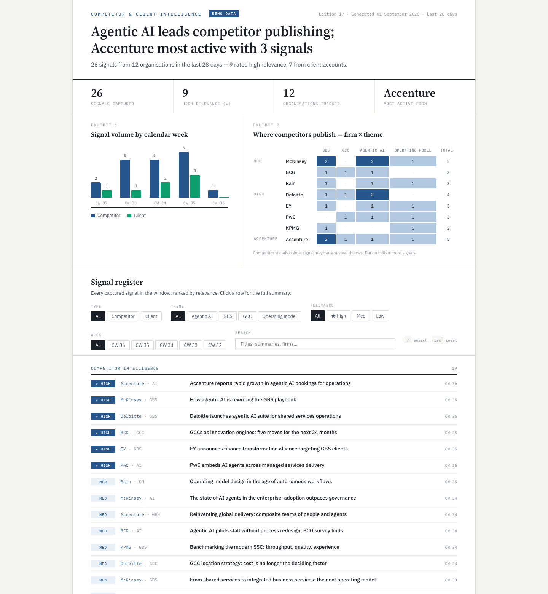
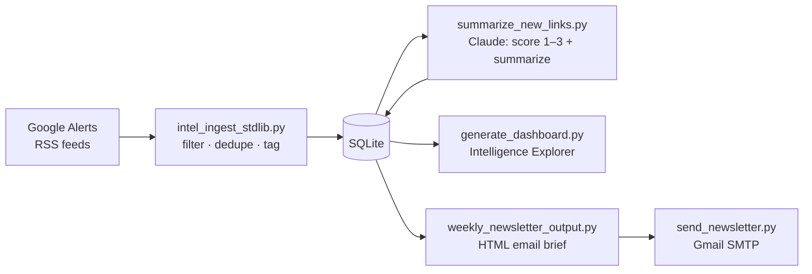
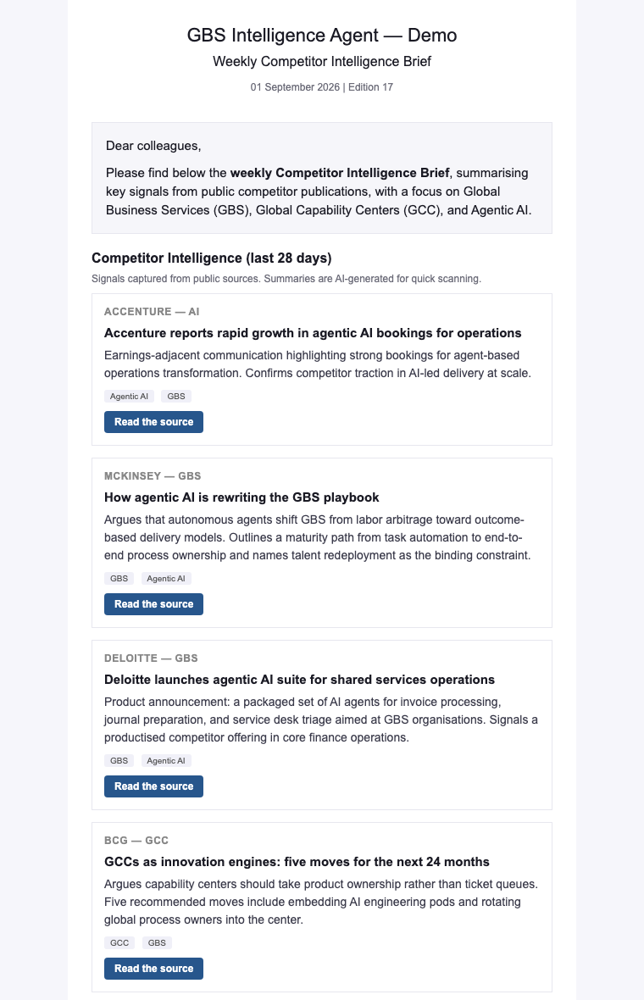

# GBS Intelligence Agent

> Automated competitor & client intelligence for GBS / Finance Transformation consulting.
> Weekly consulting-style dashboard + email brief — fully automated via cron, powered by the Claude API.

[](https://github.com/morichtereur/gbs-intelligence-agent/actions/workflows/ci.yml)


**Built by [Moritz Richter](https://www.linkedin.com/in/moritz-richter-28297119a/)**

[**▶ Live demo dashboard**](https://morichtereur.github.io/gbs-intelligence-agent/) · built from illustrative sample data, no setup needed

[](https://morichtereur.github.io/gbs-intelligence-agent/)

---

## Try it in 30 seconds

No API key, no email account, no feeds:

```bash
git clone https://github.com/morichtereur/gbs-intelligence-agent.git
cd gbs-intelligence-agent
pip3 install -r requirements.txt
python3 demo.py
```

Then open `output/DEMO/intelligence_explorer.html` and `output/DEMO/newsletter_full.html` in a browser.
The demo seeds bundled sample signals (clearly labeled as illustrative) and runs the real rendering pipeline.

---

## What it does

The agent monitors public sources for strategic signals relevant to **Global Business Services (GBS)**, **Global Capability Centers (GCC)**, and **Agentic AI** — and delivers a curated weekly intelligence product automatically.



**Every Monday morning, automatically:**
- Ingests 50+ RSS feeds across competitor firms and client companies
- Filters noise up front: job posts, people profiles, stock trackers, blocked domains
- Scores each article 1–3 for strategic relevance using Claude, with an advisory-lens prompt for client signals
- Renders an email brief with only the highest-signal articles
- Builds the Intelligence Explorer dashboard for deeper exploration
- Sends the brief by email and archives output by calendar week

The pipeline is deliberately conservative: it stops on any failed stage or feed fetch so it never sends a partial newsletter, and the edition counter is committed only after the email goes out.

---

## The weekly product

### Intelligence Explorer

A standalone consulting-style HTML dashboard focused on the consultancies — no server, no framework, just open it in a browser:

- **Answer-first headline** derived from the week's data (top theme, most active firm)
- **Firm × theme matrix** showing where competitors publish, grouped by cluster (**MBB · Big4 · Accenture**)
- **Signal list** ranked by relevance — each title links straight to the source, with the AI summary underneath
- Theme filter and full-text search, keyboard shortcuts (`/` search · `Esc` reset), print-friendly, provenance note in the footer
- Duplicate articles arriving through several alert feeds are collapsed to one entry

Client signals stay in the email brief; the dashboard deliberately keeps only the competitor view.

### Email brief



Inline-styled HTML email (renders in Outlook/Gmail), grouped by firm, high-relevance signals only, with a separate client-signals section and plain-text fallback.

---

## Relevance scoring

Each article is scored by Claude before summarizing:

| Score | Label | Meaning | Newsletter |
|---|---|---|---|
| 3 | ★ HIGH | Direct strategic signal: new offering, GBS/AI publication, C-suite move, M&A | ✅ |
| 2 | MED | Indirect signal: market commentary, trend piece | Explorer only |
| 1 | LOW | Weak signal: generic news | Explorer only |
| 0 | SKIP | Job post, stock tracker, ETF filing, economic indicator | Discarded |

Running cost is small: the default model is Claude Haiku and a weekly run scores at most `INTEL_MAX_SUMMARIZE` (30) short snippets — typically a few cents per week.

---

## Setup

### 1. Clone and install
```bash
git clone https://github.com/morichtereur/gbs-intelligence-agent.git
cd gbs-intelligence-agent
pip3 install -r requirements.txt
chmod +x run_weekly.sh
```

### 2. Configure API keys
```bash
export ANTHROPIC_API_KEY="sk-ant-..."          # https://console.anthropic.com
export GMAIL_USER="your@gmail.com"
export GMAIL_APP_PASSWORD="xxxx xxxx xxxx xxxx"  # https://myaccount.google.com/apppasswords
export INTEL_RECIPIENTS="recipient@email.com"
```

Add to `~/.zshrc` or `~/.bashrc` for persistence.

### 3. Configure feeds
```bash
cp sources.example.json sources.json
```

Edit `sources.json`:
1. Go to [google.com/alerts](https://www.google.com/alerts)
2. Create alerts with **Deliver to: RSS feed**
3. Copy feed URLs into `sources.json`
4. Add company names to `competitor_sources` or `client_sources`

### 4. Run
```bash
bash run_weekly.sh
```

Output in `output/CW_YYYY_WW/`:
- `intelligence_explorer.html` — the dashboard
- `newsletter_full.html` — full email (open in browser to preview)
- `newsletter_block.html` / `newsletter_block.txt` — article blocks only
- `client_signals.html` — client signals only

### 5. Schedule (every Monday 07:30)
```bash
(crontab -l 2>/dev/null; echo "30 5 * * 1 cd /path/to/gbs-intelligence-agent && bash run_weekly.sh >> logs/weekly.log 2>&1") | crontab -
```
Adjust UTC offset for your timezone.

---

## Customization

### Make it yours
All branding is optional and off by default, so the tool ships neutral:

```bash
export INTEL_BRAND="Competitor & Client Intelligence"   # dashboard masthead
export INTEL_BRAND_CONTEXT="a GBS transformation team at Acme Consulting"  # scoring prompt audience
export INTEL_OWNER_NAME="Your Name"                     # dashboard footer
export INTEL_OWNER_TITLE="Consultant"
export INTEL_OWNER_EMAIL="you@example.com"
export INTEL_ORG_NAME="Acme Consulting"                 # newsletter header
export INTEL_CONTACT_NAME="Your Name"                   # newsletter contact card
export INTEL_CONTACT_EMAIL="you@example.com"
```

### Add a company to track
In `sources.json`:
```json
{
  "source": "CompanyName_Finance",
  "url": "https://www.google.com/alerts/feeds/YOUR_ID/FEED_ID"
}
```
Add `"CompanyName"` to `competitor_sources` or `client_sources`.

### Add blocked domains (noise filter)
```json
"blocked_domains": ["gurufocus.com", "marketbeat.com"]
```

### Change newsletter score threshold
```bash
export INTEL_MIN_SCORE=2   # include MED signals (default: 3)
```

---

## Environment variables

| Variable | Default | Description |
|---|---|---|
| `ANTHROPIC_API_KEY` | — | **Required.** Claude API key |
| `GMAIL_USER` | — | Gmail sender |
| `GMAIL_APP_PASSWORD` | — | Gmail App Password |
| `INTEL_RECIPIENTS` | — | Comma-separated recipients |
| `INTEL_DB_PATH` | `intel.db` | SQLite database |
| `INTEL_SOURCES_PATH` | `sources.json` | Feed and tagging configuration |
| `INTEL_FAIL_ON_FEED_ERROR` | `1` | Stop before delivery when a feed fails |
| `INTEL_WINDOW_DAYS` | `7` | Newsletter lookback window |
| `INTEL_MIN_SCORE` | `3` | Minimum relevance score for the newsletter |
| `INTEL_MAX_SUMMARIZE` | `30` | Max articles to summarize per run |
| `INTEL_MAX_PER_SOURCE` | `2` | Max newsletter articles per source |
| `INTEL_DASHBOARD_WEEKS` | `4` | Explorer lookback in weeks |
| `CLAUDE_MODEL` | `claude-haiku-4-5-20251001` | Claude model |
| `CLAUDE_MAX_RETRIES` | `3` | API retries on rate limits / transient errors |
| `INTEL_BRAND` | `Competitor Intelligence` | Dashboard masthead |
| `INTEL_BRAND_CONTEXT` | generic consulting team | Audience framing in the scoring prompt |
| `INTEL_OWNER_NAME` / `_TITLE` / `_EMAIL` | — | Dashboard footer identity (hidden if unset) |
| `INTEL_ORG_NAME` | `GBS Intelligence Agent` | Newsletter header |
| `INTEL_CONTACT_NAME` / `_ROLE` / `_EMAIL` | — | Newsletter contact card (hidden if unset) |
| `INTEL_PHOTO_PATH` | `photo.jpg` | Footer photo path |
| `INTEL_DEMO_LABEL` | — | Adds a badge to the masthead (used by `demo.py`) |

---

## Stack

- **Python 3.10+** — standard library + `requests`, no heavy dependencies
- **SQLite** — lightweight local database
- **Claude Haiku** ([Anthropic](https://anthropic.com)) — fast, cheap scoring + summarization
- **Gmail SMTP** — newsletter delivery
- **Google Alerts** — RSS feed source (free)
- **Vanilla HTML/CSS/JS** — dashboard, no framework needed

---

## Suggested alert queries

The quality of the whole product starts with the alert queries. Three rules that work well in practice:

1. **Scope competitor alerts to the firm's own domain** (`site:`) — you want what they *publish*, not what journalists write about them.
2. **One alert per firm per theme** and name the feed `Firm_Theme` — the `source` name drives grouping and the dashboard matrix.
3. **Quote multi-word phrases.** Unquoted words explode the noise.

**Competitor monitoring (one per firm × theme):**
```
site:mckinsey.com ("global business services" OR "shared services" OR "integrated business services")
site:mckinsey.com ("agentic AI" OR "AI agents" OR "autonomous agents")
site:bcg.com ("capability center" OR "GCC" OR "nearshoring")
site:bain.com ("operating model" OR "service delivery model")
site:deloitte.com ("finance transformation" OR "shared services" OR "GBS")
site:accenture.com ("intelligent operations" OR "agentic" OR "managed services")
```

**Client monitoring (one per account × angle):**
```
"CompanyName" ("CFO" OR "chief financial officer" OR "finance transformation")
"CompanyName" ("shared services" OR "capability center" OR "outsourcing")
"CompanyName" ("restructuring" OR "cost reduction" OR "ERP" OR "S/4HANA")
```

Everything an alert returns still passes the pipeline's own filters: word-boundary keyword tagging (`tag_rules`), career/people-page exclusions, the stock-noise domain blocklist, and Claude's relevance scoring.

---

## License

MIT — free to use, modify, and distribute.

---

*Built as a personal project to automate competitive intelligence for GBS and finance transformation consulting. The demo dashboard and all sample data are illustrative; client companies in the demo are fictional. Contributions welcome.*
